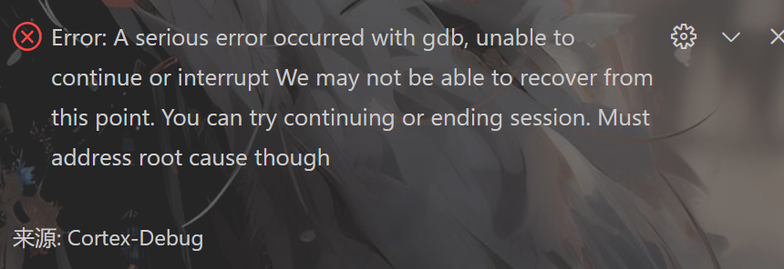

# 代码使用教程
代码采用面向对象设计思想，所有模块和外设使用需要注册对应实例，如CAN总线的:`CANRegister();`函数，具体用法可参考模块或外设的对应头文件注释

### 代码组织结构
1. `hal`：硬件抽象层，提供抽象接口，如DMA、PWM、TIMER、CAN、GPIO、I2C、SPI、UART、USB等功能
2. `bsp`：板级支持包层，提供抽象接口，如CAN总线、I2C总线、SPI总线、UART串口、LED灯、LOG日志、BUFFER缓冲区等
3. `module`：模块及外设层，提供抽象接口，如电机、推杆、算法、MODBUS协议、vofa+模块、Eeprom模块、无线模块等
4. `app`：应用程序层，提供应用程序接口，如user，动力模组，驱动服务器，运行服务器，数据服务器，数据处理服务器，远程控制服务器

##### 注意：本代码所有抽象层均基于stm的cubemx配置出的HAL库进行进一步编写，如需更改底层配置，请自行修改HAL库或使用cubemx重新生成HAL库

### GDB 调试问题
使用GDB调试时，如果突然出现调试被中断，并且vscode报错Error: A serious error occurred with gdb, unable tocontinue or interrupt  未解决！！

### Freertos的总堆容量问题
默认的堆大小为15KB，创建任务时会占用堆空间，如果堆空间不足，则创建任务会失败。得到的任务handle为NULL