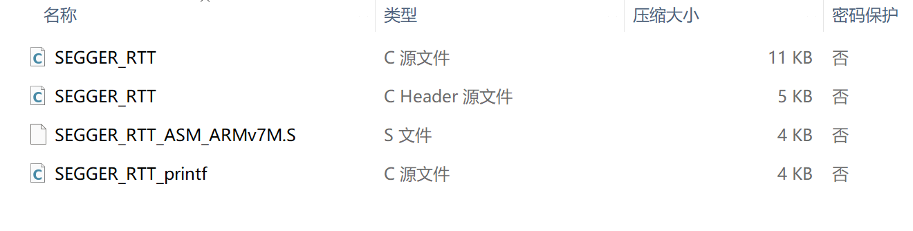
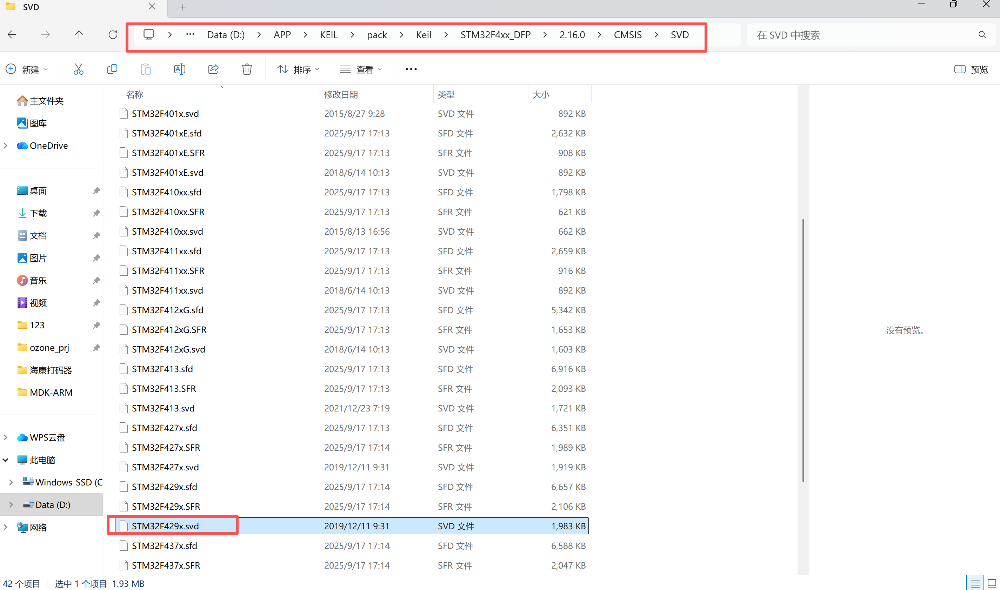
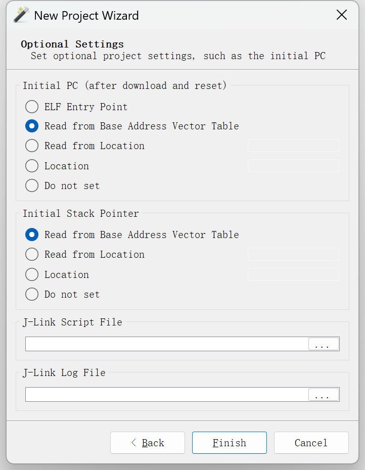
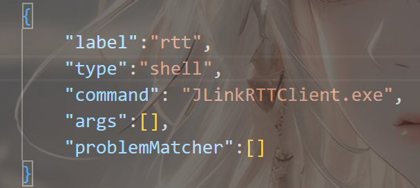
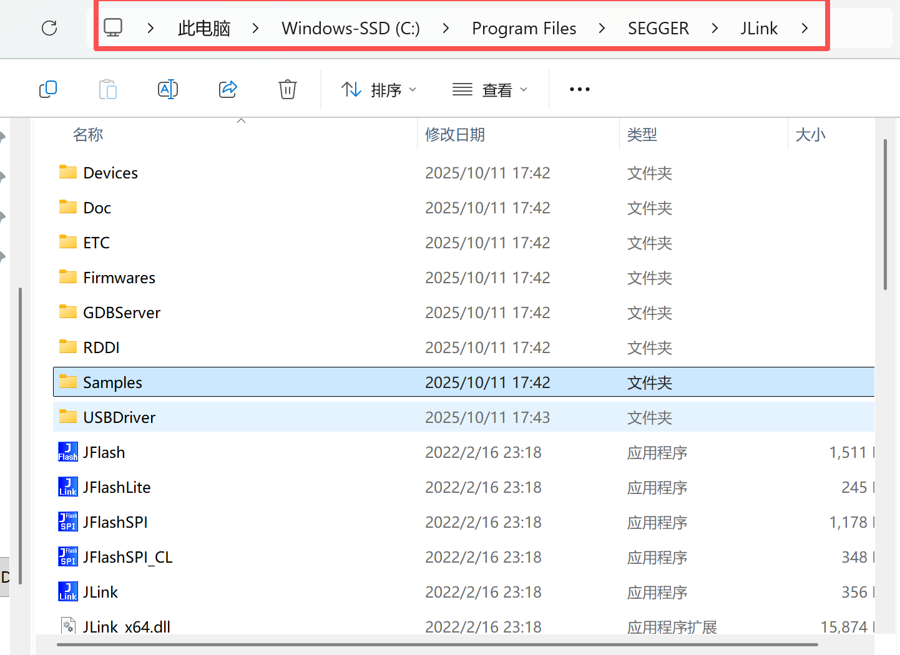

# LOG使用教程

## 1、引入RTT
下载jlink全家桶之后，找到安装路径->sample文件夹->RTT->SEGGER_RTT_(版本号).zip，解压后讲里头的RTT文件夹复制到工程目录下，将里头的几个文件加入工程中（记得添加包含路径）：


---

## 2、加入log
将bsp_log的c和h文件加入工程中(记得添加包含路径)

---

## 3、使用方法
用法和ros的LOG一样，使用方法如下：
```
BSPLogInit();//初始化日志
LOG_CLEAR();//清屏
LOG("system start");//打印出：系统开始运行
```

---

## Ozone使用
可以参考越鹿的文章[Ozone使用](https://blog.csdn.net/NeoZng/article/details/127980949)
使用的elf和svd文件，elf文件可以在工程目录下的`build`->`（工程名）文件夹`->`（工程名）.elf`，svd文件可以在官方的软件支持包里找到

##### 注意：ozone使用的elf文件的程序入口地址有误，会导致ozone中一运行就直接进入hardfault，这里建议使用基地址向量表初始化PC寄存器

ozone会有问题是打印没有颜色 不方便查找问题，同时ozone在高速打印的时候会出现乱码或者掉帧的问题，所以这里建议使用vscode的终端输出

---

## vscode使用
打开在工程目录下的.vscode文件夹下tasks.json文件，添加内容如下：

然后配置环境变量，将jlink的安装路径添加到环境变量中，如：
重启vscode，然后ctrl+p 输入task+空格+rtt+回车，然后只要点击开始调试就可以开始打印了


